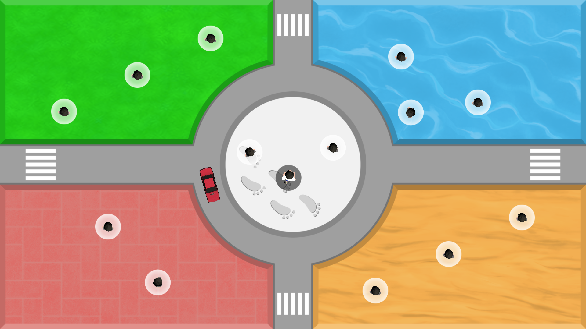
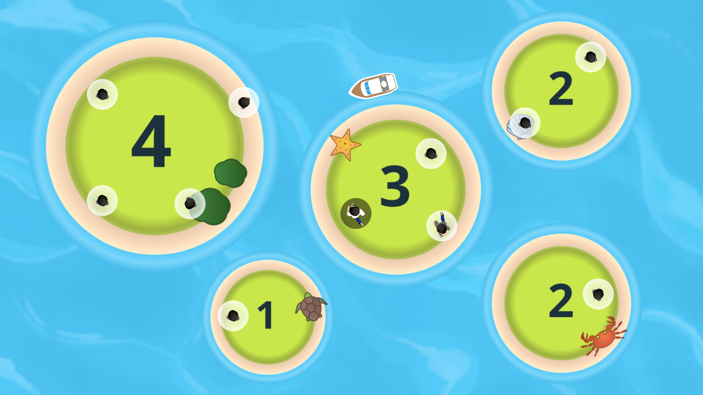
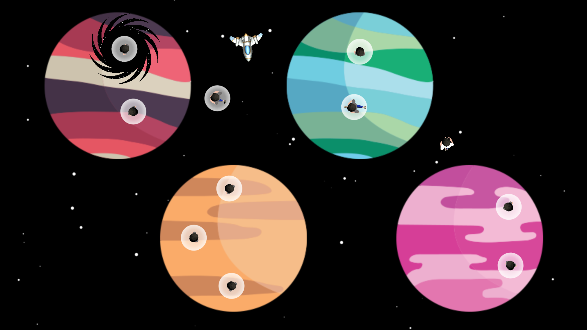
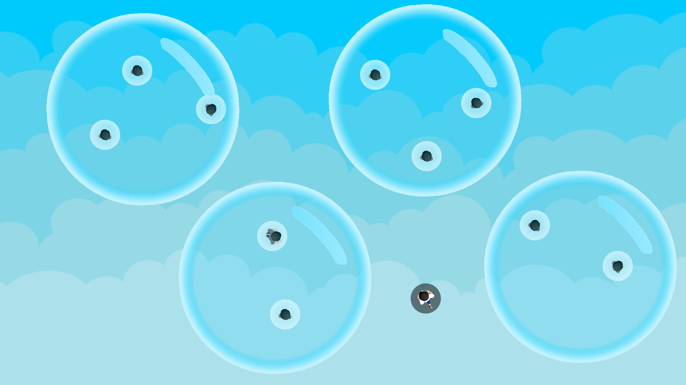

#  Crowd Ban

Crowd Ban is a game where you can direct the crowd movement to prevent over-crowding while navigating through various obstacles.

## 🎥 Demo

🌐 [Play the Game](https://wchan.itch.io/crowd-ban)

## 📸 Screenshots and Video
Level 1 - City  

 
 
Level 2 - Island  

 
 
Level 3 - Space  

 
 
Level 4 - Bubble  

 
 
<video src="https://github.com/wengcychan/crowd-ban/assets/47916143/5c8b2e73-c0ca-4638-aafd-36ed24212345" width="75%"></video>

## 🎲 Gameplay
- Tap on a person, then tap on a destination to move the person from one place to another.
- Ensure there are no more people than the assigned limit in the same place.
- Navigate through obstacles by moving people away.

## 🕹️ Controls
`Left Mouse Button` Move the person

## 🛠️ Technologies Used
- Unity
- C#
